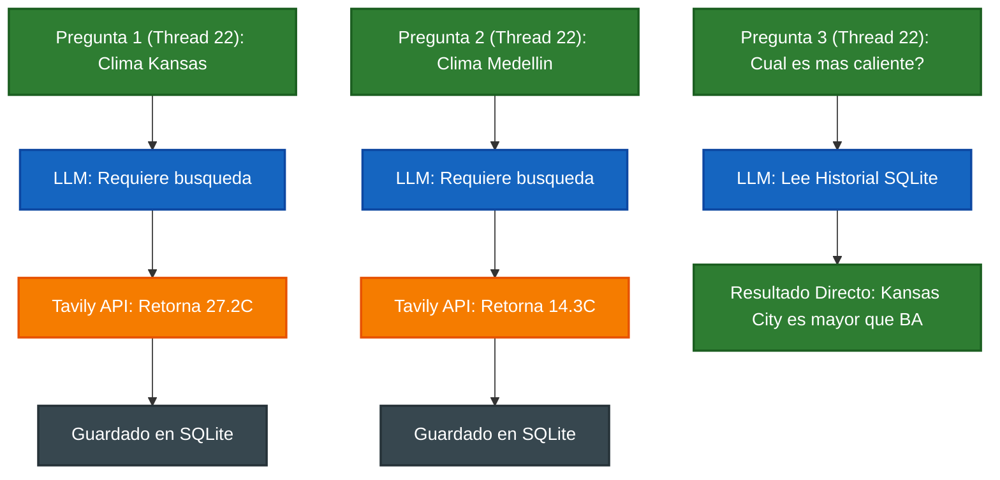

# LangGraph Agent: Persistencia y Gestión de Estado con SQLite

Este módulo contiene la implementación de un Agente de Investigación Inteligente capaz de consultar herramientas externas (Tavily Search API) y mantener una memoria conversacional a largo plazo utilizando un sistema de checkpoints basado en SQLite.

## 🚀 Lo Aprendido Hoy

### 1. Mecánica Interna del State en LangGraph
* **Grafos con Estado (Stateful Graphs):** Comprendí cómo el estado (`State`) fluye y se actualiza de forma acumulativa a través de una lista de mensajes (`messages: Annotated[list, add_messages]`).
* **Inferencia de Contexto:** El LLM no posee intuición. Su capacidad de responder a preguntas relativas (ej. *"¿Cuál es más caliente?"*) depende exclusivamente de la hidratación correcta del historial de mensajes que recibe en cada invocación.

### 2. Arquitectura de Persistencia (Memory Checkpointing)
* **El Rol del `thread_id`:** Aprendí que el `thread_id` actúa como una llave primaria de sesión (sala de chat). Si se fragmentan los IDs entre consultas, el agente pierde el contexto, quedando amnésico y forzando llamadas redundantes o erróneas a las herramientas.
* **Reducción de Latencia y Costos:** Al unificar el `thread_id`, el agente almacena en la base de datos `checkpoints.db` los outputs de las herramientas (`ToolMessage`). En consultas posteriores de comparación, el LLM resuelve la lógica matemáticamente consultando su memoria interna en SQLite, **evitando llamadas innecesarias a la API de Tavily (0% Tool Calls en el paso de comparación)**.

---

## 🛠️ Flujo de Ejecución y Anatomía del Log

El experimento de hoy demostró la madurez del agente en un flujo de 3 pasos bajo el mismo hilo (`thread_id: "22"`):




Análisis del Mensaje de Entrada (Payload Hidratado)
Al inspeccionar el objeto **stream**, se validó cómo LangGraph concatena el historial transformándolo en el contexto del modelo (**prompt_tokens** incrementales):

1- **SystemMessage**: Directivas de comportamiento del agente.

2- **HumanMessage** (Kansas) + **AIMessage** (Tool Call) + ToolMessage (JSON con **temp_c: 27.2**).

3- **HumanMessage** (Buenos Aires) + **AIMessage** (Tool Call) + **ToolMessage** (JSON con **temp_c: 14.3**).

4- **HumanMessage** (Comparación): Evaluado directamente sin activar el nodo de acción.

💻 Código de Validación Implementado
Bloque de código corregido para la captura limpia y filtrado de eventos en la etapa de decisión:

````Python
print("\n--- Pergunta 4: Comparación ---")

messages = [HumanMessage(content="¿Cuál ciudad está más caliente de las dos?")]
thread = {"configurable": {"thread_id": "22"}}  # #Hilo persistente con el historial cargado

for event in abot.graph.stream({"messages": messages}, thread):
    for k, v in event.items():
        # Filtrado semántico según los nodos del grafo del curso
        if k in ("call_groq", "take_action"):
            # Acceso directo al último elemento de la lista de mensajes para evitar verbosidad
            print(f"[{k}]: {v['messages'][-1].content}")
````

## 🎯 Conclusión Técnica

La persistencia nativa de LangGraph mediante Checkpointers transforma un modelo stateless (sin estado) en un agente capaz de resolver flujos conversacionales complejos complejos. El control estricto sobre el ciclo de vida del **thread_id** es el factor crítico de éxito para optimizar el consumo de tokens y asegurar la coherencia en las respuestas del sistema.

## 📝 Licencia

Este proyecto está bajo la Licencia MIT. Para más detalles, consulta el archivo [LICENSE](https://github.com/cris959/orquestacion-agentes-multiagentes/blob/main/LICENSE) adjunto en este repositorio.

Copyright © 2026 [Christian Garay](https://github.com//cris959/orquestacion-agentes-multiagentes) - Backend Developer.