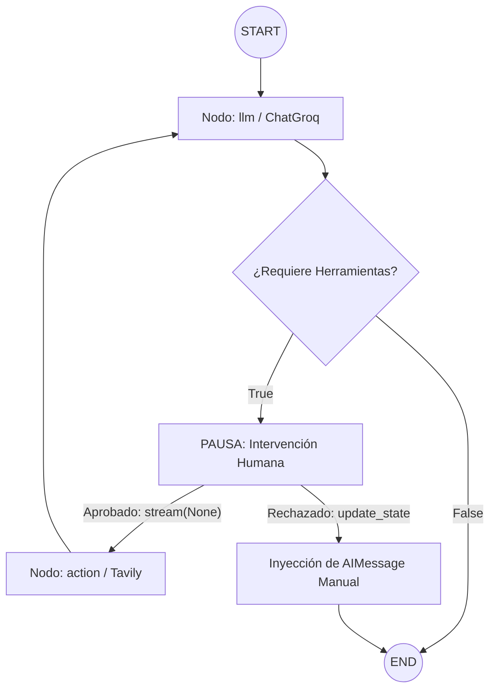

## 🤖 Clase 05: Agentes Inteligentes con Persistencia y Control Humano (Human-in-the-Loop)

¡Bienvenido al módulo de la Clase 05! En esta sección migramos nuestra arquitectura de agentes basada en el ecosistema de Google hacia Groq utilizando el modelo avanzado de código abierto **llama-3.3-70b-versatile**.

El objetivo principal de esta clase fue dominar el diseño de grafos de ejecución cíclicos con LangGraph, implementar almacenamiento persistente local mediante un checkpointer en SQLite, y diseñar un flujo crítico de Intervención Humana (Human-in-the-Loop).

## 🚀 Desafíos Clave Resueltos

1. Migración y Optimización del Entorno (Groq)

* Adiós Gemini, Hola Llama 3.3: Rediseñamos las celdas de inicialización para desconectar las dependencias de Google e integrar la librería oficial **langchain-groq**.

* Estabilización en Windows: Corregimos los errores de bloqueo del Kernel de Jupyter (Restarting Kernel) provocados por la mutación de librerías en caliente, abstrayendo las instalaciones pesadas de pip directamente hacia la terminal nativa con control de procesos (**taskkill**).

2. Reductor de Mensajes Personalizado (State Management)

* Desarrollamos una función de reducción síncrona **reduce_messages** para el estado del agente (**AgentState**).

* Control de Inmutabilidad: Resolvimos las restricciones de inmutabilidad de los modelos de Pydantic en LangChain asignando UUIDs de manera segura a los mensajes entrantes sin corromper el flujo.

3. Arquitectura del Agente con Interrupción

* Construimos un grafo de estado dirigido utilizando **StateGraph** compuesto por dos nodos principales: llm (orquestador del modelo) y **action** (ejecutor de herramientas como **TavilySearchResults**).

* Implementamos la bandera de interrupción nativa **interrupt_before=["action"]** para congelar el hilo de ejecución inmediatamente antes de que el agente realice llamadas externas a internet.

4. Flujo Human-in-the-Loop (Modificación de Estado en SQLite)

* Auditoría de Checkpoints: Inspeccionamos los metadatos almacenados en la base de datos **checkpoints.db** para analizar los identificadores de sesión (**thread_id**) y las llaves de control internas (**checkpoint_id**).

* Inyección de Respuestas: Diseñamos un flujo donde el usuario puede denegar el uso de una herramienta e inyectar un mensaje manual (**AIMessage**). El agente procesa esta corrección a través de **graph.update_state()**, pisando el estado anterior en el disco, cancelando la acción pendiente y cerrando el grafo de forma segura.

## 🛠️ Tecnologías y Dependencias Utilizadas

* Orquestador Central: **langgraph** (v0.x)

* Motor de Inferencia: **langchain-groq** (Modelo: **llama-3.3-70b-versatile**)

* Herramientas (Tools): **langchain-community** & **tavily-python** (Búsquedas en tiempo real)

* Persistencia: **langgraph-checkpoint-sqlite** & **aiosqlite**

Entorno: VS Code en entorno Windows con Python 3.10+ y variables de entorno gestionadas vía .env.

## 📊 Estructura del Grafo del Agente

El flujo operativo diseñado para este asistente de investigación sigue el siguiente ciclo de control:


## 📝 Instrucciones de Ejecución (Machete para Windows)

Si el entorno se congela o necesitas iniciar el cuaderno desde cero, sigue estos pasos en orden:

1- Matar procesos zombie de Python (Terminal de Windows):
````
taskkill /f /im python.exe
````

2- Activar el entorno virtual e instalar las dependencias limpias:
````
.venv\Scripts\Activate.ps1
pip install -U langchain langchain-groq langchain-community langgraph langgraph-checkpoint-sqlite tavily-python langchain-tavily aiosqlite python-dotenv
````

## 📝 Licencia

Este proyecto está bajo la Licencia MIT. Para más detalles, consulta el archivo [LICENSE](https://github.com/cris959/orquestacion-agentes-multiagentes/blob/main/LICENSE) adjunto en este repositorio.

Copyright © 2026 [Christian Garay](https://github.com//cris959/orquestacion-agentes-multiagentes) - Backend Developer.